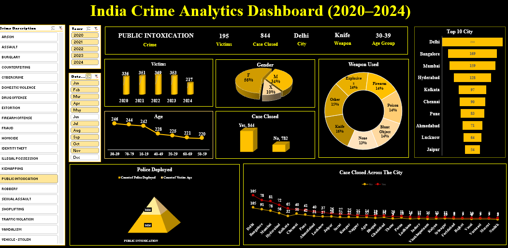

# Crime Analytics Dashboard (2020–2024)

📊 Analyzed 40,161 crime records across major Indian cities to uncover trends in victim demographics, weapons used, and case closure rates.  
🔎 Built an interactive Excel dashboard with KPIs, slicers, and charts for data-driven insights.  

## Tools
- Excel (PivotTables, Charts, Slicers)
- Data Cleaning & Visualization

## Insights
- Cases decreased in 2024 compared to previous years
- 52% case closure rate overall
- Knives and explosives most common weapons

## Dashboard Preview

